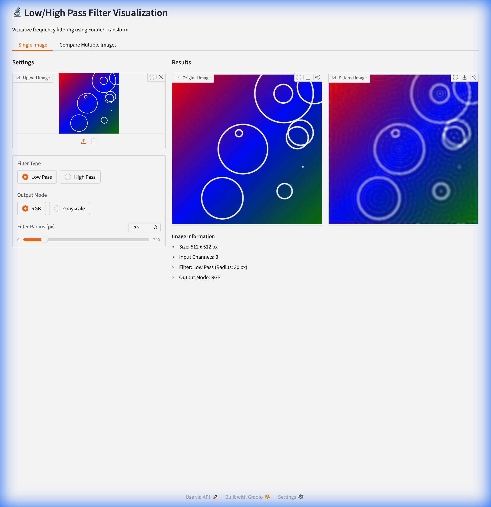

# Low/High Pass Filter Visualization

FFT-based Low/High Pass filter visualization using Gradio.



## Features

- Low/High Pass frequency filtering
- RGB / Grayscale output modes
- Real-time preview with adjustable radius
- Multi-image comparison

## Installation

```bash
uv sync
```

## Usage

```bash
uv run python app.py
```

Open http://127.0.0.1:7860

## License

MIT
